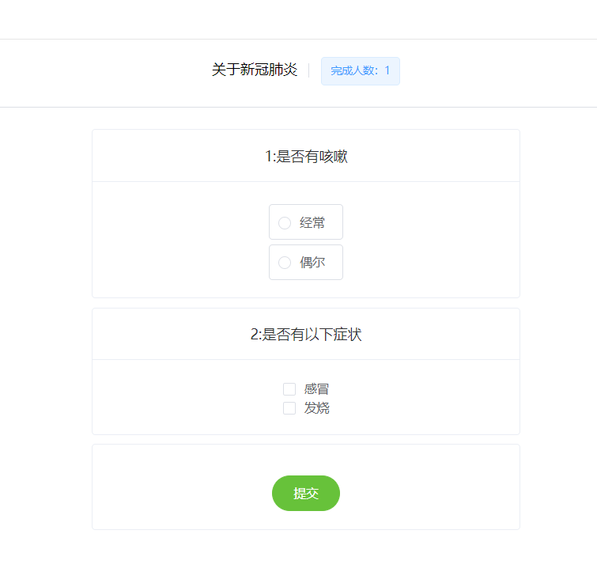

# 医疗问卷系统
前端地址  https://github.com/zyhsna/-MedicalCheckupWebFront

## 1. 框架版本

- ```
  后端
  jdk17
  spring-boot 2.6.2
  MyBatis 2.2.1
  MySQL 8.0.21
  redis 5.0主从版本
  pagehelper 1.4.1
  
  ```

- ```
  前端
  Vue 2.5.2
  Vue-router 3.0.1
  Vuex 3.6.2
  ElementUI 2.15.6
  axios 0.24.0
  ```

## 2. 相关截图

用户个人界面


用户已回答问卷界面


问卷界面



医师个人界面


新建问卷界面


 
